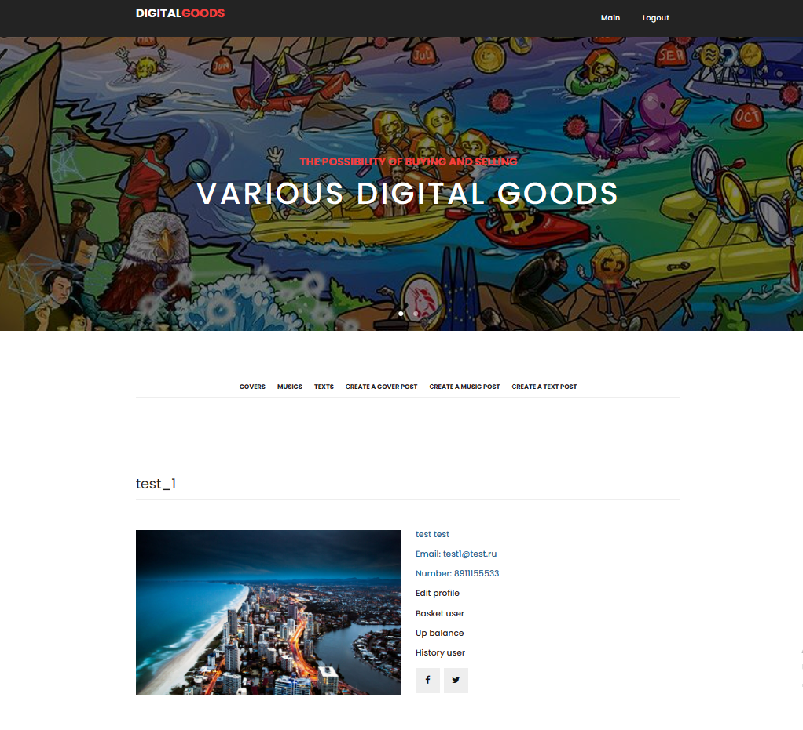
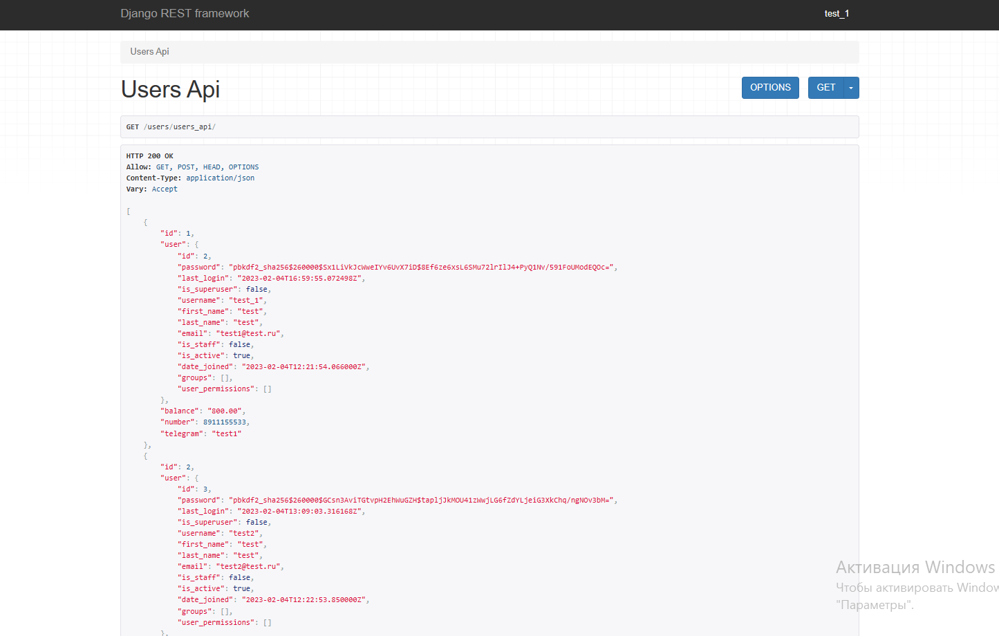
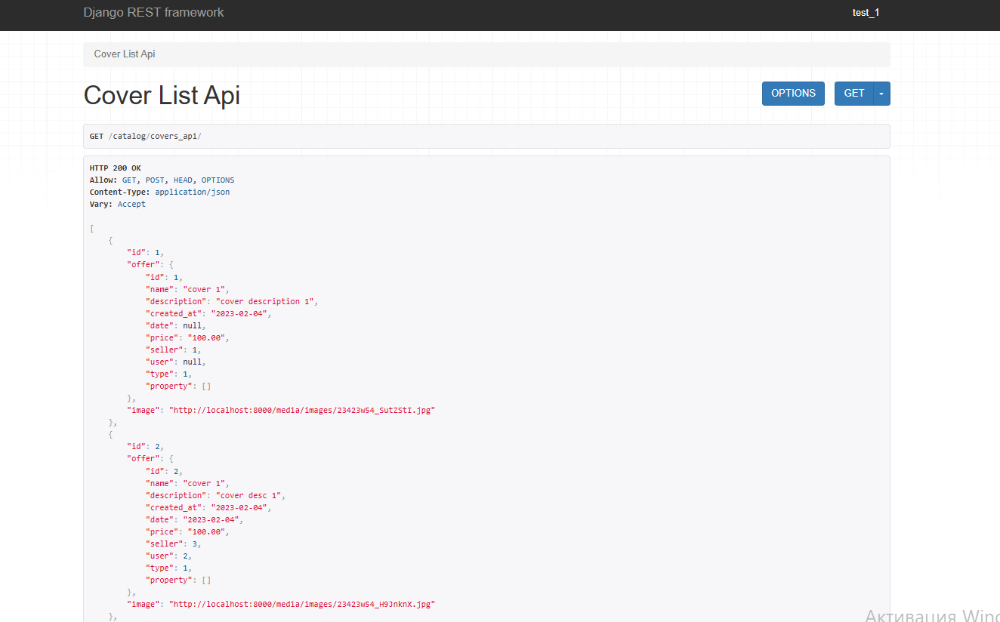
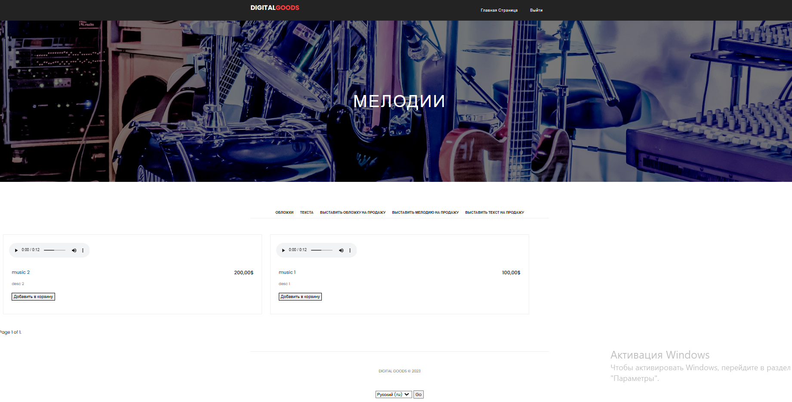

# Интернет-магазин цифровых товаров

1. [Описание](#introduction)
2. [Подготовка проекта к работе](#paragraph1)
    1. [Установка](#subparagraph1)
    2. [Запуск](#subparagraph2)
3. [Обзор](#paragraph2)
    1. [Основная информация](#subparagraph1)
    2. [Тесты](#subparagraph2)
    3. [API](#subparagraph3)
    4. [Транзакции](#subparagraph4)
    5. [Локализация и интернационализация](#subparagraph5)
    6. [Логирование](#subparagraph6)
    7. [Фикстуры и база данных](#subparagraph7)
    8. [Front-end](#subparagraph8)


## Описание <a name="introduction"></a>
В данном проекте реализован прототип интернет-магазина, 
в котором различные пользователи могут продавать и покупать картинки, 
звуковые дорожки или текста. Тем самым передавая новому пользователю 
право на использования в своих целях результат чужого интеллектуального труда.

## Подготовка проекта к работе <a name="paragraph1"></a>

### Установка <a name="#subparagraph1"></a>

Установим все необходимые библиотеки

```
pip install -r requirements.txt
```


### Запуск <a name="#subparagraph2"></a>

Для запуска проекта необходимо выполнить несколько действий. 
Для сохраниения данных в моделях необходимо сделать миграции.
```
python manage.py makemigrations
```
и применить их.
```
python manage.py migrate
```
Требуется выполнить команды по установке всех хранимых в проекте файлов фикстур:
```
python manage.py loaddata users/fixtures/user.json
python manage.py loaddata users/fixtures/profile.json
python manage.py loaddata users/fixtures/profile_image.json
```
```
python manage.py loaddata catalog/fixtures/style.json
python manage.py loaddata catalog/fixtures/genre.json
python manage.py loaddata catalog/fixtures/type_offer.json
python manage.py loaddata catalog/fixtures/offer.json
python manage.py loaddata catalog/fixtures/cover.json
python manage.py loaddata catalog/fixtures/music.json
python manage.py loaddata catalog/fixtures/music_text.json
```
Для запуска приложения выполним команду:
```
python manage.py runserver
```
Для начала работы следует перейти по адресу:
```
http://localhost:8000/users/register
```
и пройти процедуру регистрации.

Либо перейти по адресу:
```
http://localhost:8000/users/login
```
И пройти процедуру аутентификации
```
login: test_1
password: testinguser
```
## Обзор <a name="paragraph2"></a>
### Основная информация <a name="#subparagraph1"></a>
В проекте реализовано 2 приложения: ```catalog``` и ```users```.
В приложении ```users``` хранится вся основная информация. реализована 
модель пользователя со всеми дополнительными данными о нем.
В нем реализованы такие действия как аутенификация, создание и редактирование профиля, 
просмотр и очистка корзины товаров, 
покупка товаров из корзины, просмотр истории покупок пользователя за определенный период, 
а так же просмотр API пользователей.
В приложении ```catalog``` реализован функционал по просмотру имеющихся на сайте товаров, 
просмотр детальной страницы товара и добавление нового товара на сайт.

На данном скриншоте продемонстрирована страница пользователя. 
Каждая страница имеет ```header``` и ```footer```, 
на некоторых страницах так же имеются баннеры.
### Тесты <a name="#subparagraph2"></a>
Практически для всех моделей, форм и представлений проведено модульное тестирование.
### API <a name="#subparagraph3"></a>
С помощью Django rest framework были реализованы страницы с API пользователей и товаров
 
Также, при передаче дополнительных данных в get-запрос, можно проводить фильтрацию.
### Транзакции <a name="#subparagraph4"></a>
Покупка товаров на сайте использует механизм транцакций.
### Локализация и интернационализация <a name="#subparagraph5"></a>
В проекте было так же реализован механизм локализации, Основным языком является 
английский, и в качестве дополнительного языка выбран русский. 
Форма для смены языка располагается в ```footer``` сайта.

### Логирование <a name="#subparagraph6"></a>
В проекте реализован механизм логирования с помощью библиотеки 
```logging```, в файле ```degug.log``` сохраняется вся необходимая информация об 
авторизации пользователей. В файле ```degug_balance.log``` сохраняется информация о 
добавлении товаров в корзину пользователя, очистке корзины пользователя и покупке товаров.
### Фикстуры и база данных <a name="#subparagraph7"></a>
Все тестовые данные для базы данных хранятся в папке ```fixtures``` соответствующих 
приложений. В проекте используется база данных ```SQLite```.
### Front-end <a name="#subparagraph8"></a>
Интерфейс и функции на клиентской стороне веб-сайта были реализованы на основе 
скачанной бесплатной верстки. Были внесены некоторые изменения в CSS и JS файлы.
